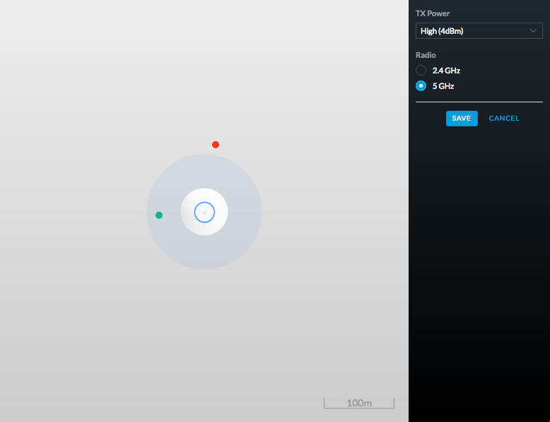

# UniFi SDN Recruitment assigment - Frontend Engineer

### Simple Wi-Fi coverage simulator

#### Requirements
* create public project on GitHub
* generate JS SPA with one of frameworks:
  * AngularJS
  * Angular
  * React
* follow [design](design.png) as close a possible
  

#### Application
* add 'Coverage Simulator' page with two panels:
  * right panel has constant width
  * left panel adapts to screen size
  * link Lato font
* draw Access Point and make it draggable:
  * link unmodified [image](https://unifi-hd.ubnt.com/5b30823e7da7b814bb226a9fc0802a19.png) as a resource
  * coverage area is rgba(68, 137, 244, 0.4)
* implement simple configuration panel for Access Point:
  * tx power options:
    * High 4dBm
    * Medium -6dBm
    * Low -16dBm
  * radio options
    * 2.4 GHz
    * 5 GHz
  * save button should apply changes to coverage calculator
  * cancel button restore previous values
* draw and generate 10 clients (receivers):
  * all are represented by dots
  * initial position is random
* calculate and draw coverage in 2D:
  * clients within range of signal -80dBm should be green
  * other clients should be red
  * coverage area should represents signal -80dB  
  * use https://en.wikipedia.org/wiki/Free-space_path_loss with configured TX power and radio frequency of Access Point
  * to simplify task please assume that:
    * Access Point uses omnidirectional antenna
    * there is no power loss on transmitter antenna
    * client (receiver) has antenna with 1dBm gain

#### Design

